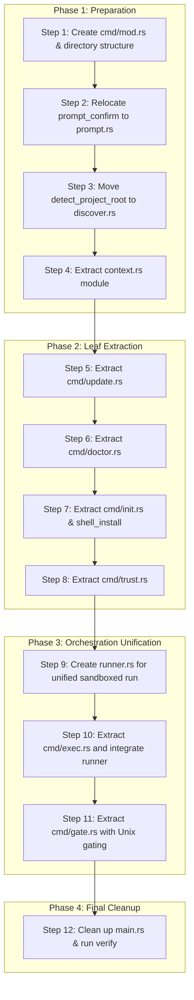

# CPLT Subcommand Refactoring & Extraction Plan (Refined)

This document outlines the step-by-step strategy for refactoring `src/main.rs` by extracting its subcommand handlers into a modular structure under `src/cmd/` and consolidating binary orchestration logic. 

This version incorporates recommendations from the Adversarial Code Review, resolving architectural flaws regarding separation of concerns, parent-child circular dependencies, Unix-specific compilation safety, and sandbox runner duplication.

---

## 1. Architectural Blueprint & Target Module Boundaries

The table below describes the target location and boundary separation for each helper function and module.

| Module | Location | Purpose / Scope |
| :--- | :--- | :--- |
| **`cplt::discover`** | `src/discover.rs` (Lib) | House environment probes including project root discovery (`detect_project_root`). |
| **`cli`** | `src/cli.rs` (Bin) | CLI Argument parser declarations (`Cli` and subcommand enums). |
| **`prompt`** | `src/prompt.rs` (Bin) | Interactive user prompts (`prompt_confirm`), keeping the library crate headless and embeddable. |
| **`context`** | `src/context.rs` (Bin) | CLI context resolution (`resolve_context`, `ResolvedContext`, path canonicalization). |
| **`runner`** | `src/runner.rs` (Bin) | Unified sandbox runner orchestrator (`run_sandboxed`), eliminating sandbox setup code duplication. |
| **`cmd/`** | `src/cmd/` (Bin) | Subcommand handlers. `exec` delegates to `runner.rs`. `gate` is gated under `#[cfg(unix)]`. |
| **`main`** | `src/main.rs` (Bin) | Clean entry point, parses CLI arguments, and dispatches directly. |

---

## 2. Step-by-Step Refactoring Plan



### Phase 1: Preparation (Steps 1 – 4)

1. **Step 1: Create `src/cmd/` directory & `mod.rs`**
   * Create `src/cmd/` and initialize an empty `src/cmd/mod.rs`.
   * Add `mod cmd;` to `src/main.rs`.
2. **Step 2: Extract `prompt_confirm` to `src/prompt.rs`**
   * Create `src/prompt.rs` in the binary crate.
   * Move `prompt_confirm` from `src/main.rs` to `src/prompt.rs` as `pub fn prompt_confirm(...)`.
   * Declare `mod prompt;` in `src/main.rs` and update all caller references to `prompt::prompt_confirm`.
3. **Step 3: Move `detect_project_root` to `src/discover.rs` in the Library**
   * Relocate `detect_project_root()` from `src/main.rs` to `src/discover.rs` inside the library crate `cplt`.
   * Expose it as `pub fn detect_project_root() -> Option<PathBuf>`.
   * Resolve any imports (e.g. `std::path::PathBuf`) in `src/discover.rs`.
   * Update references in `src/main.rs` to call `cplt::discover::detect_project_root()`.
4. **Step 4: Relocate CLI Context to `src/context.rs`**
   * Create `src/context.rs` in the binary crate.
   * Move `ResolvedContext`, `resolve_context`, `canonicalize_paths`, and `canonicalize_deny_paths` to `src/context.rs`.
   * Expose `ResolvedContext` and `resolve_context` as `pub(crate)`.
   * Update `src/main.rs` imports to use `context::{resolve_context, ResolvedContext}`.

### Phase 2: Leaf-Module Extraction (Steps 5 – 8)

5. **Step 5: Extract `cmd/update.rs`**
   * Move `run_update` and `do_update` from `src/main.rs` to `src/cmd/update.rs`.
   * Declare `pub mod update;` in `src/cmd/mod.rs` and call `cmd::update::run_update` in `main.rs`.
6. **Step 6: Extract `cmd/doctor.rs`**
   * Move `run_doctor` to `src/cmd/doctor.rs`.
   * Resolve imports, updating the project root call to `cplt::discover::detect_project_root`.
   * Declare `pub mod doctor;` in `src/cmd/mod.rs` and dispatch in `main.rs`.
7. **Step 7: Extract `cmd/init.rs`**
   * Move `run_init_command`, `run_init_global_command`, and `shell_install` to `src/cmd/init.rs`.
   * Declare `pub mod init;` in `src/cmd/mod.rs` and dispatch in `main.rs`.
8. **Step 8: Extract `cmd/trust.rs`**
   * Move `run_trust_command`, `trust_show`, `trust_accept`, and `trust_revoke` to `src/cmd/trust.rs`.
   * Update imports and path checks. Expose `run_trust_command` as `pub`.
   * Declare `pub mod trust;` in `src/cmd/mod.rs` and dispatch in `main.rs`.

### Phase 3: Orchestration Unification (Steps 9 – 11)

9. **Step 9: Create `src/runner.rs` for Sandboxed Runs**
   * Create `src/runner.rs` in the binary crate.
   * Unify the setup orchestration into a single function:
     ```rust
     pub(crate) fn run_sandboxed(
         context: context::ResolvedContext,
         exec_bin: std::path::PathBuf,
         exec_args: Vec<String>,
         show_denials: bool,
         print_profile: bool,
     ) -> anyhow::Result<std::process::ExitCode>
     ```
   * Cut sandbox preparation, preflight check, user confirmation prompt, denial-log spawning, and `exec_sandboxed` out of `src/main.rs` (lines 675 – 911) and consolidate them into this function.
10. **Step 10: Extract `cmd/exec.rs`**
    * Move `run_exec_command` and `resolve_exec_binary` to `src/cmd/exec.rs`.
    * Refactor `run_exec_command` to receive a pre-resolved `ResolvedContext` and binary details.
    * Delegate the actual execution block to `crate::runner::run_sandboxed`.
    * Refactor the main agent execution path in `src/main.rs` to also delegate its sandboxed execution block to `crate::runner::run_sandboxed`.
11. **Step 11: Extract `cmd/gate.rs` with Unix gating**
    * Move `run_gh_gate`, `run_git_gate`, and their respective process-replacement helper functions to `src/cmd/gate.rs`.
    * Target-compile-gate the module at the top of `src/cmd/gate.rs` and in `src/cmd/mod.rs`:
      ```rust
      // In src/cmd/mod.rs
      #[cfg(unix)]
      pub mod gate;
      ```
    * Update the dispatch in `src/main.rs` under `#[cfg(unix)]` blocks.

### Phase 4: Final Cleanup (Step 12)

12. **Step 12: Tidy up `src/main.rs` & Verify**
    * Clean up unused imports, dead comments, and re-exports in `src/main.rs`.
    * Verify that the entry point `main` and top-level router `run(cli)` are simple, readable, and well-documented.
    * Run `mise run check` to ensure clippy, formatting, and all unit/integration tests pass cleanly.

---

## 3. QA Checks & Verification

*   **Clippy Verification**: After each step, run `cargo clippy --all-targets -- -D warnings` to verify compilation.
*   **Test Suite Verification**: Run `mise run test:all` to ensure no functionality is regressed.
*   **Compilation Gating Verification**: Since Unix-specific process replacement `std::os::unix::process::CommandExt` is confined to `cmd/gate.rs` which is compile-gated with `#[cfg(unix)]`, verify that running `cargo check` under simulated non-Unix environments succeeds.
